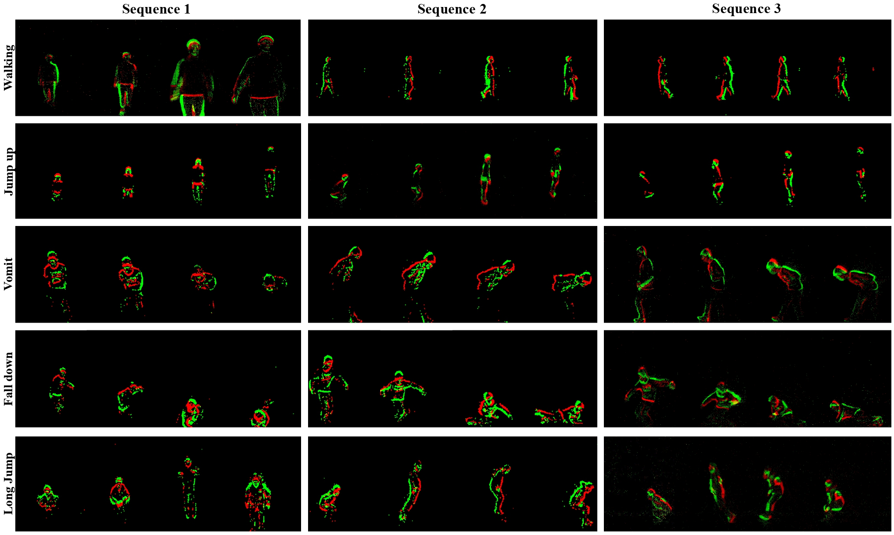
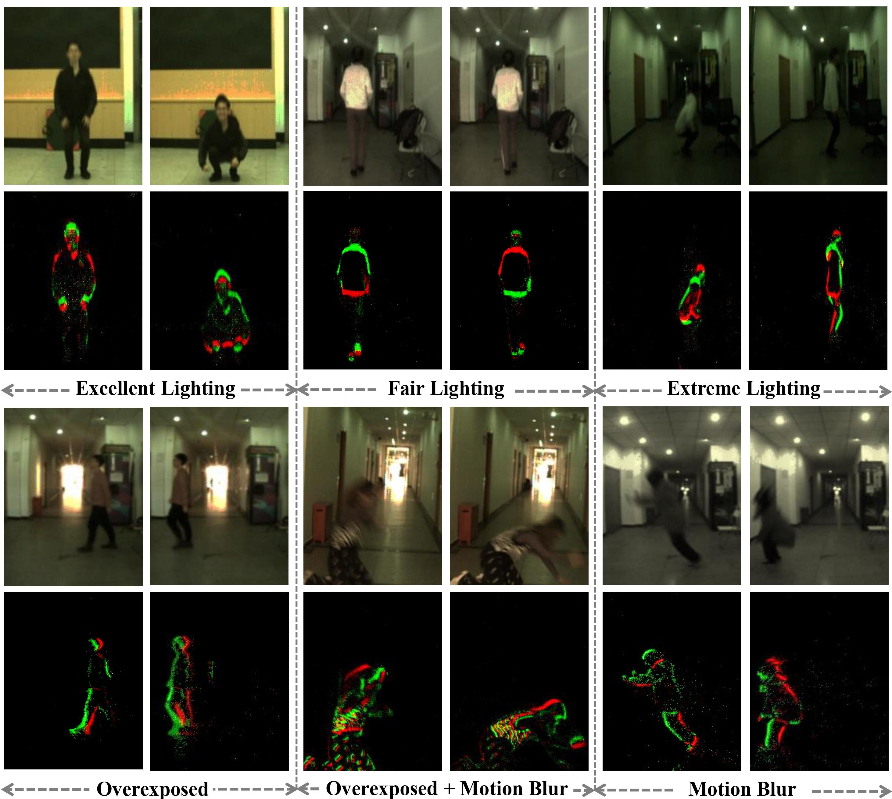

# THUE-ACT-50: A Real-World Event-Based Action Recognition Benchmark

Introduced by the paper, "[Action Recognition and Benchmark Using Event Cameras](https://ieeexplore.ieee.org/abstract/document/10198747)" in TPAMI 2023, **THUE-ACT-50** stands as a large-scale, real-world event-specific action recognition dataset with more than 4 times the size of the current largest event-based action recognition dataset. It contains 50 action categories and is primarily designed for whole-body motions and indoor healthcare applications. This repository provides access to the dataset, alongside detailed information about its contents and structure.

## Dataset Overview

**THUE-ACT-50** is designed to address the limitations of existing event-based action recognition datasets, which are often too small and limited in the range of actions they cover. The dataset consists of two parts: the standard **THUE-ACT-50** and a more challenging version,**THUE-ACT-50 CHL**, which is designed to test the robustness of algorithms under challenging conditions.

The dataset comprises a diverse set of action categories, including whole-body motions, indoor healthcare applications, detail-oriented actions, confusing actions, human-object interactions, and two-player interactive movements. With a total of 10,500 video recordings for the standard **THUE-ACT-50** and 2,330 recordings for the challenging **THUE-ACT-50 CHL**, this dataset provides an extensive and varied collection of action sequences for researchers to explore and evaluate their models.

## Dataset Description

### Standard THUE-ACT-50

- 50 event-specific action categories
- 105 socially recruited subjects
- 10,500 video recordings
- CeleX-V event camera with a spatial resolution of 1280x800
- Two oblique front views of the actor

### Challenging THUE-ACT-50 CHL

- Challenging scenarios with different illumination conditions and action magnitudes
- 50 event-specific action categories
- 18 on-campus students as subjects
- 2,330 video recordings
- DAVIS346 event camera with a spatial resolution of 346x260
- Front, left, right, and back views
- Two different scenarios: long corridor and open hall
- Challenging conditions including:

## List of Actions

| ID | Action                  | ID | Action                  | ID | Action                  | ID | Action                  | ID | Action                                |
|-----------|-------------------------|-----------|-------------------------|-----------|-------------------------|-----------|-------------------------|-----------|---------------------------------------|
| A0        | Walking                 | A10       | Cross arms              | A20       | Calling with phone      | A30       | Fan                     | A40       | Check time                            |
| A1        | Running                 | A11       | Salute                  | A21       | Reading                 | A31       | Open umbrella           | A41       | Drink water                           |
| A2        | Jump up                 | A12       | Squat down              | A22       | Tai chi                 | A32       | Close umbrella          | A42       | Wipe face                             |
| A3        | Running in circles      | A13       | Sit down                | A23       | Swing objects           | A33       | Put on glasses          | A43       | Long jump                             |
| A4        | Falling down            | A14       | Stand up                | A24       | Throw                   | A34       | Take off glasses        | A44       | Push up                               |
| A5        | Waving one hand         | A15       | Sit and stand           | A25       | Staggering              | A35       | Pick up                 | A45       | Sit up  |
| A6        | Waving two hands        | A16       | Knead face              | A26       | Headache                | A36       | Put on bag              | A46       | Shake hands (two-players)             |
| A7        | Clap                    | A17       | Nod head                | A27       | Stomachache             | A37       | Take off bag            | A47       | Fighting (two-players)                |
| A8        | Rub hands               | A18       | Shake head              | A28       | Back pain               | A38       | Put object into bag     | A48       | Handing objects (two-players)         |
| A9        | Punch                   | A19       | Thumb up                | A29       | Vomit                   | A39       | Take object out of bag  | A49       | Lifting chairs (two-players)          |

## Evaluation Criteria

To evaluate the performance of event-based action recognition methods on the **THUE-ACT-50** and **THUE-ACT-50 CHL**  datasets, we divided the subjects in a ratio of 8:2 to create disjoint identity sets for training and testing. The training and test sets of the **THUE-ACT-50** dataset contain 85 and 20 persons, respectively, while the training and test sets of the **THUE-ACT-50 CHL** dataset contain 14 and 4 persons, respectively.

We report the following evaluation metrics for each dataset:

- **Top-1 Accuracy:** The percentage of test videos for which the model correctly predicts the action category with the highest confidence.
- **Top-N Accuracy:** The percentage of test videos for which the correct action category is within the top N predictions made by the model.

## Dataset Download

We're pleased to announce the release of the **THUE-ACT-50** and **THUE-ACT-50 CHL** datasets. 

### **THUE-ACT-50**

+ **OneDrive:** [Download Here](https://mailstsinghuaeducn-my.sharepoint.com/:u:/g/personal/lujx20_mails_tsinghua_edu_cn/EVAfzCmMfH9KtQhHh37hCFIBXrszDqLXtOfjBir2__GTjg?e=rnUht0)
+ **BaiduYun:** [Download Here](https://pan.baidu.com/s/1ohCswORXFMyEho3A6nKnSg) (Access Code: `4csp`) 

*Note*: After decompression, the dataset will require about 332GB of storage space.

### **THUE-ACT-50 CHL**

+ **Google Drive:** [Download Here](https://drive.google.com/file/d/1a5r6cw0nVX0Xe-ZzVLAhEwa9oMm4MUbS/view?usp=sharing) 
+ **BaiduYun:** [Download Here](https://pan.baidu.com/s/1R6Q2U5By_h16S_TdkCRM4A) (Access Code: `fdnd`) 

*Note*: After decompression, the dataset will occupy approximately 4.6GB of storage space.

## Acknowledgements

We would like to express our sincere gratitude to Tsinghua University, partner companies, and organizations for their invaluable support and collaboration in making this dataset possible. Additionally, we extend our thanks to all the volunteers who participated in the data collection process. Their contributions have been instrumental in the development and evaluation of this benchmark.

## Citing Our Work

If you find this dataset beneficial for your research, please cite our work:

> @article{gao2023action,
>     title={Action Recognition and Benchmark Using Event Cameras},
>     author={Gao, Yue and Lu, Jiaxuan and Li, Siqi and Ma, Nan and Du, Shaoyi and Li, Yipeng and Dai, Qionghai},
>     journal={IEEE Transactions on Pattern Analysis and Machine Intelligence},
>     year={2023},
>     publisher={IEEE}
> }

